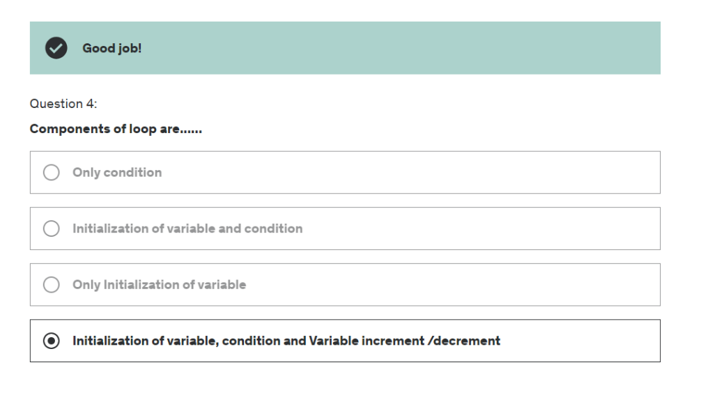

# Type Casting
Type casting is the process of converting one data type to another.

# Implicit Type Casting
short x = 5;
int y = x;
this is an example of implicit type casting. The compiler automatically converts the value of x to an int and assigns it to y.
but if we do vice versa then will be an error because the compiler cannot convert an int to a short.

# it depends on type implicit type casting or automatic typecasting needs to have same or higher range of same data type.
float and int are not compatible with each other. so we need to do explicit type casting.
check the above image for more details.

# Explicit Type Casting

int y = 10;
short x = (short)y;   // syntax for explicit type casting
System.out.println(x);
There will be no error because we are explicitly converting the value of y to short and assigning it to x.
we can cast to also byte. but there is loss of precision and data because data is truncated.

# For both implicit and explicit type casting we need to have compatible data types.
int cant be converted to string and vice versa.
# vvimp we can explicitly convert int to float and vice versa.
implicitly type casting between int and float is possible.
it is possible to convert int to float implicitly because float has higher range than int same for double and long.
but it is not possible to convert float to int here we have to do explicit type casting.

public class Hello2 {

	public static void main(String[] args) {
		// TODO Auto-generated method stub
		int a = 25;
		float b = 42.159f;
		double value = a*a + 2*(a*b) + b*b;
		System.out.println(value);
		

	}

}
output : 4510.3310546875
didn't lose any precision because we are using double.
# for int value = (int)(a*a + 2*(a*b) + b*b);

# mostly use double instead of float because double has higher range than float and double is more precise than float.

const and goto are reserved keywords but not used in java.

# Operators

# ternary operator similar to javascript
(condition) ? (if true) : (if false)
# Assignment Operators
=, +=, -=, *=, /=, %=, &=, |=, ^=, >>=, <<=, >>>=
# vvimp in if condition if we dont put scope brackets then the next line will be considered as the scope of if condition. same for else
int x = 2; 
if (x==2);
system.out.println("Hello");
here Hello will be printed because the next line is considered as the scope of if condition. and ; wont cause any error.

# Switch Statement

switch(expression) {
    case value1:
        // code
        break;
    case value2:
        // code
        break;
    case value3:
        // code
        break;
    default:
        // code
        break;
}

sequence of writing does not matter in switch case.
any switch case can be written using if else ladder. we cant use float and double in switch case. we can only use int enum and char in switch case and also string.
They are case sensitive. 

you can even write 

case 'a':
case 'A':
    // code
    break;

for both case same code will be executed.

# infinite loop in for loop condition for(;;) or while(true) or do while(true)
# loops has initialisation, condition and increment/decrement.

do {
} while (condition);

# sophisticated for loop you can even use or operator in condition
for (int i = 0, j = 0; i < 10 && j < 10; i++, j++) {
    // code
}

break terminates the loop and continue skips the current iteration and goes to the next iteration.

Quiz

