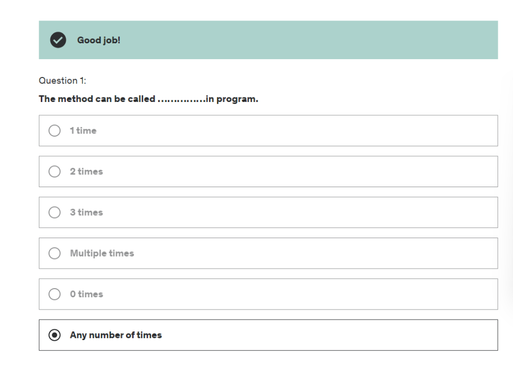
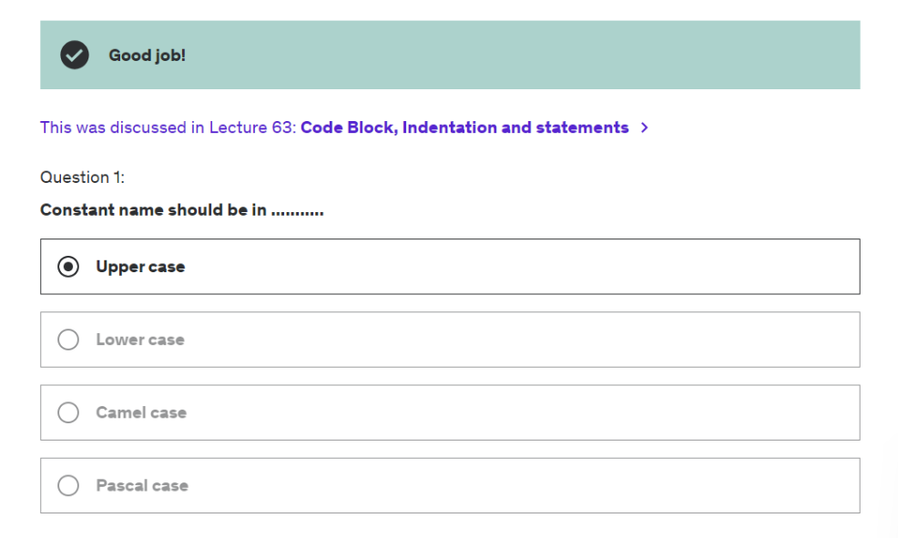
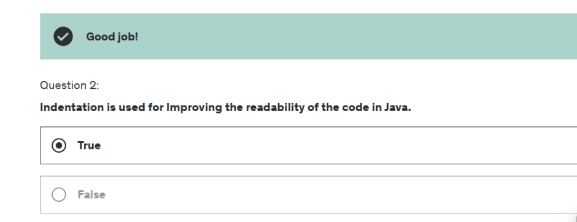
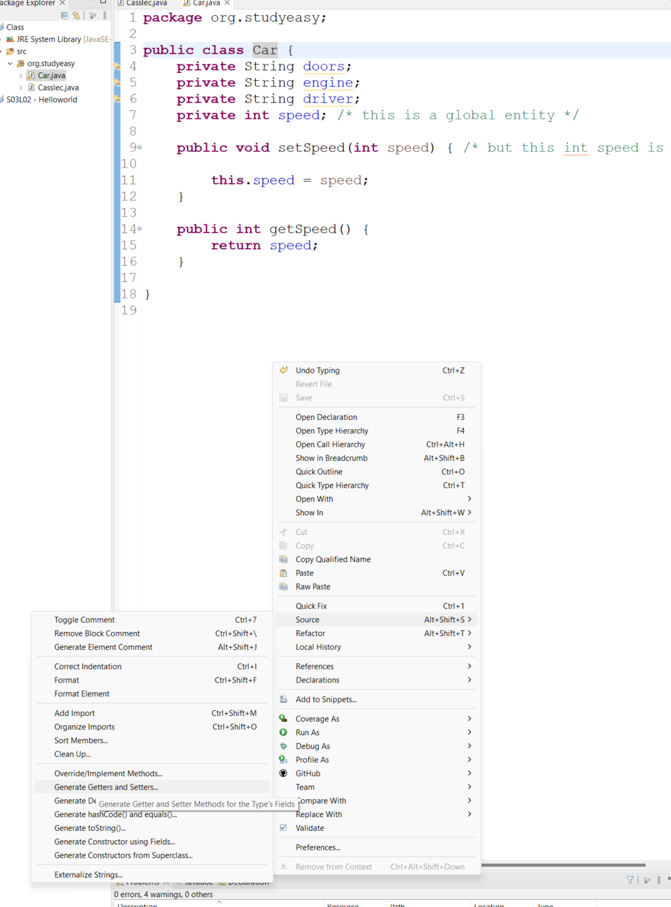
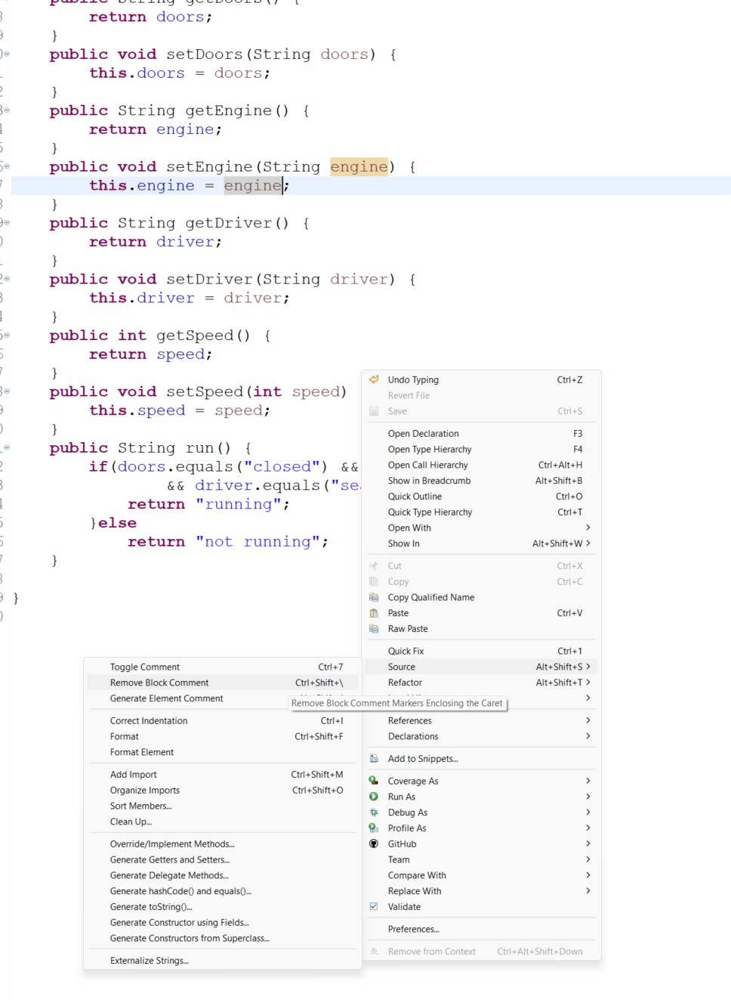

# Methods in java
how to make a function in java
public static void main(String[] args) {
    // code
loop1();
loop2();
}

public static void loop1() {
    // code
}
etc
Methods can be used to make code more readable and reusable.

double value = calculateInterest(10000, 2.5, 3);

public static double calculateInterest(double amount, double interestRate, double years) {
    return amount * (interestRate/100) * years;
}

if you don't specify double value =  and just call the function like calculateInterest(10000, 2.5, 3); then it will return nothing.
or system.out.println(calculateInterest(10000, 2.5, 3)); will print the value.

# Method Overloading
methods can have same name but different parameters. if there are different number of parameters or different data types of parameters then it is called method overloading.
and java will call the method according to the parameters passed. you can even modify the return type and same name and same number of parameter this too is method overloading. and will work.

package org.studyeasy;

public class Hello2 {

	public static void main(String[] args) {
		System.out.println("1+2 "+sum(1,2));
		System.out.println("1,2.5 "+sum(1,2.5F)); 
		System.out.println("1.3,2.3 "+sum(1.3,2.3));
	}
	
	public static int sum(int x, int y) {
		System.out.println("Adding 2 int entities: ");
		return x+y;
	}
	
	public static float sum(int x, float y) {
		System.out.println("Adding 1 int and 1 float entity: ");
		return x+y;
	}
	
	public static double sum(double x, double y) {
		System.out.println("Adding 2 doubles: ");
		return x+y;
	}

}

# vvimp 
calculate prime = new calculate();
here the first calculate is referring to the class it self and new + calculate() is initializing the constructor to create a new object. and that new object is stored in prime variable.

package org.studyeasy;

public class Calculate {

	public boolean isPrime(int num) {
		int temp;
		boolean isPrime = true;
		for (int i = 2; i <= num / 2; i++) {
			temp = num % i;
			if (temp == 0) {
				isPrime = false;
				break;
			}
		}
		return isPrime;
	}
	
	public boolean isPrime(double doublenum) {
		int num = (int)doublenum;
		int temp;
		boolean isPrime = true;
		for (int i = 2; i <= num / 2; i++) {
			temp = num % i;
			if (temp == 0) {
				isPrime = false;
				break;
			}
		}
		return isPrime;
	}

}

import org.studyeasy.Calculate;

public class Demo {

	public static void main(String[] args) {
		
		Calculate prime = new Calculate();
		if(prime.isPrime(7.5)) {
			System.out.println("Number passed is prime");
		}else {
			System.out.println("Number passed is not prime");
		}

	}

}

# A method is a code block but it may have inner code blocks
a for loop is a code block inside a method which itself is a code block.

# Literals in java
Literals in java are a sequence of characters that represent constant values to be storedin variables.

# Integer Literals
Literals used for different number systems
Prefix 0 is used to indicate octal number system and 0x is used to indicate hexadecimal number system.
here 0 and 0x are literals.
Prefix 0B/0b is used to indicate binary number system.

# Floating point literals
Java has two types of floating point literals
float and double
Default type is double

float doubleval = 12.25D; // here D is a literal
for float we use F or f as a literal

It explicitly tells the compiler that the value is of type float or double.

# Character literals
Assign a character literal for assignment of char variable.
char x = 'v';
char m = 062;

ANSI chart for more details.

# Escape sequences

Escapes or Unescapes is a string removing traces of offending characters that could prevent compiling.

Backspace is replaced with \b
Newline is replaced with \n
Tab is replaced with \t
Carriage return is replaced with \r
Form feed is replaced with \f
Single quote is replaced with \'
Double quote is replaced with \"
Backslash is replaced with \\

# Null literal
Null is not a keyword,null is a literal used to specify null value (nothing) for an element.

# Boolean literals
The values true and false are literals in java.
true means correct and false means incorrect.

# Classes and objects OOPS
Class is a blueprint for creating objects.
Objects are instances of a class.
Const should have naming in UpperCase.
Class should have naming in CamelCase.
properties and state are same.
behaviour and methods (functionality) are same.
Properties or states are usually private and methods or functionality are public.

So to access the properties we use getters and setters methods.
Default of int is 0;

package org.studyeasy;

public class Casslec {

	public static void main(String[] args) {
		Car car = new Car();
		car.setSpeed(10);    // public method setSpeed
		System.out.println(car.getSpeed());   // public method getSpeed
		
		
	}

}

package org.studyeasy;

public class Car {
private String doors;
private String engine;
private String driver;
private int speed;       /* this is a global entity */

	public void setSpeed(int speed) {   // in this function the parameter speed is a local entity since it is is passed as a parameter in local scope. so it wont be accessible out of this function.
                                        //hence there will be a error to access the global speed which is passed as a parameter
                                        // You need to use "this" keyword we made a function getSpeed() and setSpeed() to be accessed by the main function.
                                        // while keeping properties private.
		this.speed = speed;
	}

	public int getSpeed() {
		return speed;
	}

}

other way is to select the class as in image then right click and select source and then generate getters and setters.

package org.studyeasy;

public class Car {

	public String getDoors() {
		return doors;
	}
	public void setDoors(String doors) {
		this.doors = doors;
	}
	public String getEngine() {
		return engine;
	}
	public void setEngine(String engine) {
		this.engine = engine;
	}
	public String getDriver() {
		return driver;
	}
	public void setDriver(String driver) {
		this.driver = driver;
	}
	public int getSpeed() {
		return speed;
	}
	public void setSpeed(int speed) {
		this.speed = speed;
	}
	private String doors;
	private String engine;
	private String driver;
	private int speed; /* this is a global entity */

}

package org.studyeasy;

public class Casslec {

	public static void main(String[] args) {
		Car car = new Car();
		car.setDoors("closed");
		System.out.println(car.getDoors());
	}

}

# Classes-Adding 
functionality into class
functionality means let say running a car.
speed, doors, engine, driver are properties of a car or states of a car.

# To check strings in java use classObjects.equals("string");
make sure values are initialized before using them else it will lead to null pointer exception.

package org.studyeasy;

public class Car {

	public String getDoors() {
		return doors;
	}
	public void setDoors(String doors) {
		this.doors = doors;
	}
	public String getEngine() {
		return engine;
	}
	public void setEngine(String engine) {
		this.engine = engine;
	}
	public String getDriver() {
		return driver;
	}
	public void setDriver(String driver) {
		this.driver = driver;
	}
	public int getSpeed() {
		return speed;
	}
	public void setSpeed(int speed) {
		this.speed = speed;
	}
	public String run() {
		if(doors.equals("closed") && engine.equals("on")
				&& driver.equals("seated") && speed > 0) {
			return "running";
		}else 
			return "not running";
	}
	private String doors;
	private String engine;
	private String driver;
	private int speed; /* this is a global entity */
}

package org.studyeasy;

public class Casslec {

	public static void main(String[] args) {
		Car car = new Car();
		car.setDoors("closed");
		car.setDriver("seated");
		car.setEngine("on");
		car.setSpeed(10);
		System.out.println(car.run());
	}

}

once initialized then run as above example.
this above is an example of pojo plain old java object.

# Constructor
Constructor is a special method that is used to initialize objects.

	private String doors = "opened";
	private String engine = "off";
	private String driver = "absent";
	private int speed = 0; /* this is a global entity */

you can manually initialize the values as above but it is not a good practice.
so we use constructor to initialize the values.

# constructor has same name as class name it has no return type since it does not return anything.'
constructor is by default called when a object is created hence its the right place to initialize the values.

like this
package org.studyeasy;

public class Car {

	private String doors;
	private String engine;
	private String driver;
	private int speed; 
	
	public Car() {
		doors = "opened";
		engine = "off";
		driver = "absent";
		speed = 0;
	}

	public String getDoors() {
		return doors;
	}
	public void setDoors(String doors) {
		this.doors = doors;
	}
	public String getEngine() {
		return engine;
	}
	public void setEngine(String engine) {
		this.engine = engine;
	}
	public String getDriver() {
		return driver;
	}
	public void setDriver(String driver) {
		this.driver = driver;
	}
	public int getSpeed() {
		return speed;
	}
	public void setSpeed(int speed) {
		this.speed = speed;
	}
	public String run() {
		if(doors.equals("closed") && engine.equals("on")
				&& driver.equals("seated") && speed > 0) {
			return "running";
		}else 
			return "not running";
	}
}

or for custom values right click on class and select source and then generate constructor using fields.

super method is used to call the constructor of the parent class.

# Overloading of the constructor since they have same name but different parameters.

	public Car() {
		doors = "opened";
		engine = "off";
		driver = "absent";
		speed = 0;
	}
	
	public Car(String doors, String engine, String driver, int speed) {

		this.doors = doors;
		this.engine = engine;
		this.driver = driver;
		this.speed = speed;
	}

package org.studyeasy;

public class Casslec {

	public static void main(String[] args) {
		Car car = new Car("closed","on","seated",10);		
		System.out.println(car.run());
	}

}

# Default constructor

When there is no constructor in the class then java will create a default constructor.
a default constructor is a constructor with no parameters just a statement like this.

public Car() {
}

if you add the constructor with custom parameters then java will not create a default constructor.
if both constructors are present then there will be errors. either you create a constructor or let java create a default constructor.
if you create it using source then it will create a default constructor with no parameters.

# Usage of Constructor

