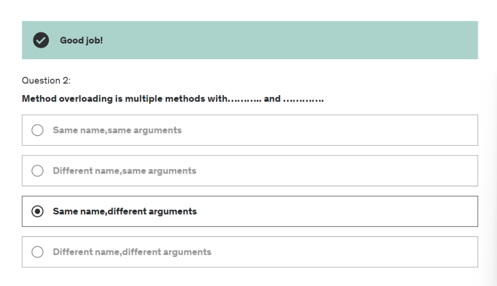

# Methods in java
how to make a function in java
public static void main(String[] args) {
    // code
loop1();
loop2();
}

public static void loop1() {
    // code
}
etc
Methods can be used to make code more readable and reusable.

double value = calculateInterest(10000, 2.5, 3);

public static double calculateInterest(double amount, double interestRate, double years) {
    return amount * (interestRate/100) * years;
}

if you don't specify double value =  and just call the function like calculateInterest(10000, 2.5, 3); then it will return nothing.
or system.out.println(calculateInterest(10000, 2.5, 3)); will print the value.

# Method Overloading
methods can have same name but different parameters. if there are different number of parameters or different data types of parameters then it is called method overloading.
and java will call the method according to the parameters passed. you can even modify the return type and same name and same number of parameter this too is method overloading. and will work.

package org.studyeasy;

public class Hello2 {

	public static void main(String[] args) {
		System.out.println("1+2 "+sum(1,2));
		System.out.println("1,2.5 "+sum(1,2.5F)); 
		System.out.println("1.3,2.3 "+sum(1.3,2.3));
	}
	
	public static int sum(int x, int y) {
		System.out.println("Adding 2 int entities: ");
		return x+y;
	}
	
	public static float sum(int x, float y) {
		System.out.println("Adding 1 int and 1 float entity: ");
		return x+y;
	}
	
	public static double sum(double x, double y) {
		System.out.println("Adding 2 doubles: ");
		return x+y;
	}

}

# vvimp 
calculate prime = new calculate();
here the first calculate is referring to the class it self and new + calculate() is initializing the constructor to create a new object. and that new object is stored in prime variable.

package org.studyeasy;

public class Calculate {

	public boolean isPrime(int num) {
		int temp;
		boolean isPrime = true;
		for (int i = 2; i <= num / 2; i++) {
			temp = num % i;
			if (temp == 0) {
				isPrime = false;
				break;
			}
		}
		return isPrime;
	}
	
	public boolean isPrime(double doublenum) {
		int num = (int)doublenum;
		int temp;
		boolean isPrime = true;
		for (int i = 2; i <= num / 2; i++) {
			temp = num % i;
			if (temp == 0) {
				isPrime = false;
				break;
			}
		}
		return isPrime;
	}

}

import org.studyeasy.Calculate;

public class Demo {

	public static void main(String[] args) {
		
		Calculate prime = new Calculate();
		if(prime.isPrime(7.5)) {
			System.out.println("Number passed is prime");
		}else {
			System.out.println("Number passed is not prime");
		}

	}

}

