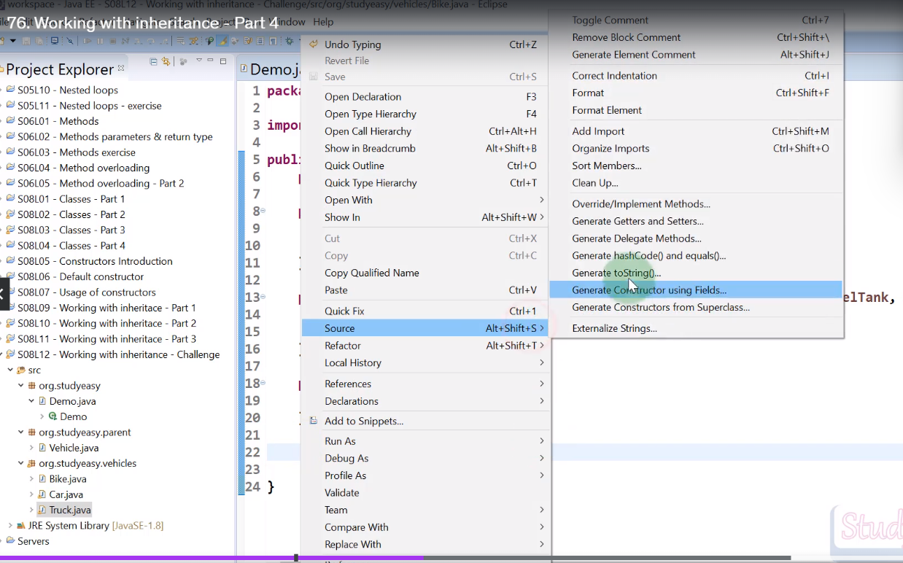
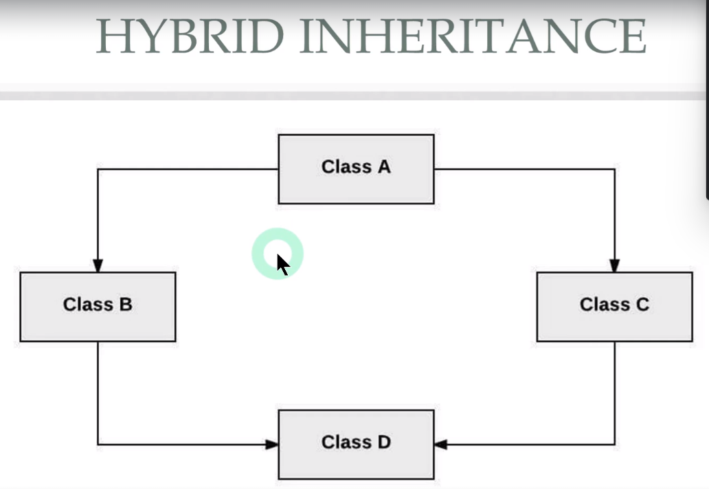

# Inheritance
inheritance means that one class can inherit the attributes and methods of another class.

Bike car and Truck.
BIke has wheels , engine, seats, handle, fuel tank, lights
Car has wheels, engine, seats, steering wheel, fuel tank, lights
Truck has wheels, engine, seats, steering wheel, fuel tank, lights, trailer

A lot of them has common attributes and methods. So we can create a class called Vehicle and make all of them inherit from it.
common properties are wheels, engine, seats, fuel tank, lights.

properties of parent class are inherited by child class.

package org.studyeasy;

import org.studyeasy.vehicles.Bike;

public class Demo {

	public static void main(String[] args) {
		Bike bike = new Bike();
		bike.handle = "Short";
		bike.engine = "Petrol";
		
		System.out.println(bike.engine);

	}

}
************************************************************
package org.studyeasy.parent;

public class Vehicle {

public String engine;
public int wheels;
public int seats;
public int fuelTank;
public String lights;
}

************************************************************

package org.studyeasy.vehicles;

import org.studyeasy.parent.Vehicle;

public class Bike extends Vehicle{
public String handle;

}

************************************************************
package org.studyeasy.vehicles;

import org.studyeasy.parent.Vehicle;

public class Car extends Vehicle{

	public String steering;
	public String musicSystem;
	public String airConditioner;
	public String fridge;
	public String entertainmentSystem;
}

************************************************************

package org.studyeasy.vehicles;

import org.studyeasy.parent.Vehicle;

public class Truck extends Vehicle{
public String	steering;
public String	musicSystem;
public String airConditioner;
public int	container;

}
***********************************************************

when a property is declared as private in parent class, it is not inherited by child class.
we will get null pointer exception. field is not visible.

package org.studyeasy.parent;

public class Vehicle {

private String engine;
private int wheels;
private int seats;
private int fuelTank;
private String lights;

public Vehicle() {
this.engine = "petrol";
this.wheels = 4;
this.seats = 4;
this.fuelTank = 35;
this.lights = "LED";

}

	public Vehicle(String engine, int wheels, int seats, int fuelTank, String lights) {

		this.engine = engine;
		this.wheels = wheels;
		this.seats = seats;
		this.fuelTank = fuelTank;
		this.lights = lights;
	}

public String getEngine() {
return engine;
}

public int getWheels() {
return wheels;
}

public int getSeats() {
return seats;
}

public int getFuelTank() {
return fuelTank;
}

public String getLights() {
return lights;
}

}

package org.studyeasy.vehicles;

import org.studyeasy.parent.Vehicle;

public class Bike extends Vehicle{
private String handle;

	public Bike() {
		super();
		this.handle = "short";
	}

	public Bike(String handle) {
		super();
		this.handle = handle;
	}

	public String getHandle() {
		return handle;
	}

}

package org.studyeasy.vehicles;

import org.studyeasy.parent.Vehicle;

public class Car extends Vehicle{

	private String steering;
	private String musicSystem;
	private String airConditioner;
	private String fridge;
	private String entertainmentSystem;
	}

package org.studyeasy.vehicles;

import org.studyeasy.parent.Vehicle;

public class Truck extends Vehicle{
private String	steering;
private String	musicSystem;
private String airConditioner;
private int	container;

}

package org.studyeasy;

import org.studyeasy.vehicles.Bike;

public class Demo {

	public static void main(String[] args) {
		Bike bike = new Bike();
	    System.out.println(bike.getHandle());
	   System.out.println(bike.getEngine());
	}

}

# super() call to the default constructor of parent class.
we dont need to specify super() in parent class constructor.

here we are calling the default constructor of parent class and child class.

package org.studyeasy;

import org.studyeasy.vehicles.Bike;

public class Demo {

	public static void main(String[] args) {
        Bike bike = new Bike("long", "Deisel",4, 5, 40, "LED");
        System.out.println("Handle: "+bike.getHandle());
        System.out.println("Engine type: "+bike.getEngine());
        System.out.println("Number of seats: "+bike.getSeats());
        System.out.println("Feul tank capacity: "+bike.getFuelTank());
	    System.out.println("Head lamp type: "+bike.getLights());
	    System.out.println("Number of wheels: "+bike.getWheels());
	    
	
	}

}

package org.studyeasy.parent;

public class Vehicle {

private String engine;
private int wheels;
private int seats;
private int fuelTank;
private String lights;

public Vehicle() {
this.engine = "petrol";
this.wheels = 4;
this.seats = 4;
this.fuelTank = 35;
this.lights = "LED";

}

	public Vehicle(String engine, int wheels, int seats, int fuelTank, String lights) {

		this.engine = engine;
		this.wheels = wheels;
		this.seats = seats;
		this.fuelTank = fuelTank;
		this.lights = lights;
	}

public String getEngine() {
return engine;
}

public int getWheels() {
return wheels;
}

public int getSeats() {
return seats;
}

public int getFuelTank() {
return fuelTank;
}

public String getLights() {
return lights;
}

}

package org.studyeasy.vehicles;

import org.studyeasy.parent.Vehicle;

public class Bike extends Vehicle{
private String handle;

	public Bike() {
		super();
		this.handle = "short";
	}

	public Bike(String handle,String engine, int wheels, int seats, int fuelTank, String lights) {
		super(engine,wheels,seats,fuelTank,lights);
		this.handle = handle;
	}

	public String getHandle() {
		return handle;
	}

}

package org.studyeasy.vehicles;

import org.studyeasy.parent.Vehicle;

public class Car extends Vehicle{

	private String steering;
	private String musicSystem;
	private String airConditioner;
	private String fridge;
	public String entertainmentSystem;
	}

package org.studyeasy.vehicles;

import org.studyeasy.parent.Vehicle;

public class Truck extends Vehicle{
private String	steering;
private String	musicSystem;
private String airConditioner;
private int	container;

}

# parameterized constructor of parent class.

How to call the parameterized constructor of parent class from child class.

package org.studyeasy;

import org.studyeasy.vehicles.Bike;

public class Demo {

	public static void main(String[] args) {
        Bike bike = new Bike("long", "Deisel",4, 5, 40, "LED");
        System.out.println("Handle: "+bike.getHandle());
        System.out.println("Engine type: "+bike.getEngine());
        System.out.println("Number of seats: "+bike.getSeats());
        System.out.println("Feul tank capacity: "+bike.getFuelTank());
	    System.out.println("Head lamp type: "+bike.getLights());
	    System.out.println("Number of wheels: "+bike.getWheels());
	    
	
	}

}
package org.studyeasy.parent;

public class Vehicle {

private String engine;
private int wheels;
private int seats;
private int fuelTank;
private String lights;

public Vehicle() {
this.engine = "petrol";
this.wheels = 4;
this.seats = 4;
this.fuelTank = 35;
this.lights = "LED";

}

	public Vehicle(String engine, int wheels, int seats, int fuelTank, String lights) {

		this.engine = engine;
		this.wheels = wheels;
		this.seats = seats;
		this.fuelTank = fuelTank;
		this.lights = lights;
	}

public String getEngine() {
return engine;
}

public int getWheels() {
return wheels;
}

public int getSeats() {
return seats;
}

public int getFuelTank() {
return fuelTank;
}

public String getLights() {
return lights;
}

}
package org.studyeasy.vehicles;

import org.studyeasy.parent.Vehicle;

public class Bike extends Vehicle{
private String handle;

	public Bike() {
		super();
		this.handle = "short";
	}

	public Bike(String handle,String engine, int wheels, int seats, int fuelTank, String lights) {
		super(engine,wheels,seats,fuelTank,lights);
		this.handle = handle;
	}

	public String getHandle() {
		return handle;
	}

}
package org.studyeasy.vehicles;

import org.studyeasy.parent.Vehicle;

public class Car extends Vehicle{

	private String steering;
	private String musicSystem;
	private String airConditioner;
	private String fridge;
	public String entertainmentSystem;
	}

package org.studyeasy.vehicles;

import org.studyeasy.parent.Vehicle;

public class Truck extends Vehicle{
private String	steering;
private String	musicSystem;
private String airConditioner;
private int	container;

}

when a object is printed it directly calls the toString() method of the object class. but we can override it.

highlight the file then right click and select source and generate toString() method.
select values from the methods and inherit methods. make sure to not select getClass() hascode and toString() methods.

# to see how constructors getter setters inheritance and toString() super() works see section 8 working with inheritance challenge folder 
all files of vehicle, demo, bike, car, truck are there.

# Overriding methods in inheritance

let's say you write a method in parent class

public void run() {
System.out.println("Vehicle is running");
}
 and same method in child class lets say bike to have the exact same method.
# then when you call the method from child class object it will call the method from child class and not from parent class. by calling bike.run();
if run method is only in parent class then it will call the method from parent class.

# Type of inheritance and exercise information.
1. Single inheritance: when a class inherits from only one class. where parent is known as parent class and child is known as child class or subclass.
2. Multiple inheritance: when a class inherits from more than one class. multiple inheritance is not allowed in java. because of ambiguity. parent classes may have same methods names and properties. so it is not allowed in java. you may get run time error.
3. Hierarchical inheritance: when one parent class is inherited by multiple child classes.
4. Multi-level inheritance: when a class inherits from a class which is already a child class of another class. in java parent class are known as super class and child clasas are known as subclass.
5. Hybrid inheritance: when a class is inherited from multiple classes and one of the parent class is inherited by another class. it is not allowed in java.
 might give error same reason as multiple inheritance.
if methods are not same then it will work.

Exercise:
class animal: parent class
properties: height, weight, animalType, bloodType

class reptile: child class
properties: Dry skin, backbone, soft-shelled eggs

class Fish : child class
properties: live in water, has gills

class Birds: child class
properties: Animals with feathers, can fly

class Crocodile: child class of reptile
properties: hard-shelled eggs, shovInfo() will give all the information about the crocodile.
override  soft-shelled eggs to hard-shelled eggs.

class Eel: child class of fish
properties: release electric charge, shovInfo() will give all the information about the Eel.

class Eagle: child class of birds
properties: shovInfo() will give all the information about the Eagle.

add shovent() method in all the classes.

