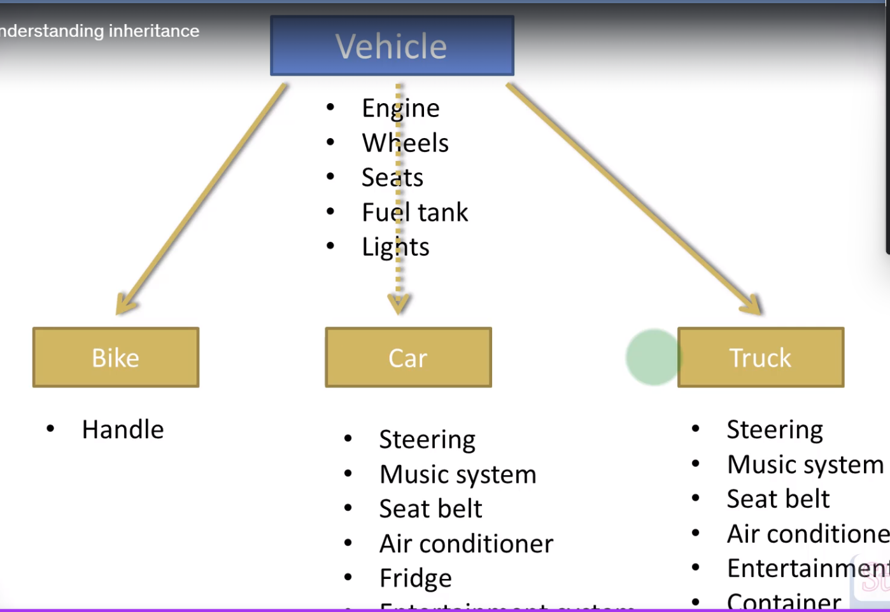

# Inheritance
inheritance means that one class can inherit the attributes and methods of another class.

Bike car and Truck.
BIke has wheels , engine, seats, handle, fuel tank, lights
Car has wheels, engine, seats, steering wheel, fuel tank, lights
Truck has wheels, engine, seats, steering wheel, fuel tank, lights, trailer

A lot of them has common attributes and methods. So we can create a class called Vehicle and make all of them inherit from it.
common properties are wheels, engine, seats, fuel tank, lights.

properties of parent class are inherited by child class.

package org.studyeasy;

import org.studyeasy.vehicles.Bike;

public class Demo {

	public static void main(String[] args) {
		Bike bike = new Bike();
		bike.handle = "Short";
		bike.engine = "Petrol";
		
		System.out.println(bike.engine);

	}

}
************************************************************
package org.studyeasy.parent;

public class Vehicle {

public String engine;
public int wheels;
public int seats;
public int fuelTank;
public String lights;
}

************************************************************

package org.studyeasy.vehicles;

import org.studyeasy.parent.Vehicle;

public class Bike extends Vehicle{
public String handle;

}

************************************************************
package org.studyeasy.vehicles;

import org.studyeasy.parent.Vehicle;

public class Car extends Vehicle{

	public String steering;
	public String musicSystem;
	public String airConditioner;
	public String fridge;
	public String entertainmentSystem;
}

************************************************************

package org.studyeasy.vehicles;

import org.studyeasy.parent.Vehicle;

public class Truck extends Vehicle{
public String	steering;
public String	musicSystem;
public String airConditioner;
public int	container;

}
***********************************************************

when a property is declared as private in parent class, it is not inherited by child class.
we will get null pointer exception. field is not visible.

package org.studyeasy.parent;

public class Vehicle {

private String engine;
private int wheels;
private int seats;
private int fuelTank;
private String lights;

public Vehicle() {
this.engine = "petrol";
this.wheels = 4;
this.seats = 4;
this.fuelTank = 35;
this.lights = "LED";

}

	public Vehicle(String engine, int wheels, int seats, int fuelTank, String lights) {

		this.engine = engine;
		this.wheels = wheels;
		this.seats = seats;
		this.fuelTank = fuelTank;
		this.lights = lights;
	}

public String getEngine() {
return engine;
}

public int getWheels() {
return wheels;
}

public int getSeats() {
return seats;
}

public int getFuelTank() {
return fuelTank;
}

public String getLights() {
return lights;
}

}

package org.studyeasy.vehicles;

import org.studyeasy.parent.Vehicle;

public class Bike extends Vehicle{
private String handle;

	public Bike() {
		super();
		this.handle = "short";
	}

	public Bike(String handle) {
		super();
		this.handle = handle;
	}

	public String getHandle() {
		return handle;
	}

}

package org.studyeasy.vehicles;

import org.studyeasy.parent.Vehicle;

public class Car extends Vehicle{

	private String steering;
	private String musicSystem;
	private String airConditioner;
	private String fridge;
	private String entertainmentSystem;
	}

package org.studyeasy.vehicles;

import org.studyeasy.parent.Vehicle;

public class Truck extends Vehicle{
private String	steering;
private String	musicSystem;
private String airConditioner;
private int	container;

}

package org.studyeasy;

import org.studyeasy.vehicles.Bike;

public class Demo {

	public static void main(String[] args) {
		Bike bike = new Bike();
	    System.out.println(bike.getHandle());
	   System.out.println(bike.getEngine());
	}

}

# super() call to the default constructor of parent class.
we dont need to specify super() in parent class constructor.

here we are calling the default constructor of parent class and child class.

package org.studyeasy;

import org.studyeasy.vehicles.Bike;

public class Demo {

	public static void main(String[] args) {
        Bike bike = new Bike("long", "Deisel",4, 5, 40, "LED");
        System.out.println("Handle: "+bike.getHandle());
        System.out.println("Engine type: "+bike.getEngine());
        System.out.println("Number of seats: "+bike.getSeats());
        System.out.println("Feul tank capacity: "+bike.getFuelTank());
	    System.out.println("Head lamp type: "+bike.getLights());
	    System.out.println("Number of wheels: "+bike.getWheels());
	    
	
	}

}

package org.studyeasy.parent;

public class Vehicle {

private String engine;
private int wheels;
private int seats;
private int fuelTank;
private String lights;

public Vehicle() {
this.engine = "petrol";
this.wheels = 4;
this.seats = 4;
this.fuelTank = 35;
this.lights = "LED";

}

	public Vehicle(String engine, int wheels, int seats, int fuelTank, String lights) {

		this.engine = engine;
		this.wheels = wheels;
		this.seats = seats;
		this.fuelTank = fuelTank;
		this.lights = lights;
	}

public String getEngine() {
return engine;
}

public int getWheels() {
return wheels;
}

public int getSeats() {
return seats;
}

public int getFuelTank() {
return fuelTank;
}

public String getLights() {
return lights;
}

}

package org.studyeasy.vehicles;

import org.studyeasy.parent.Vehicle;

public class Bike extends Vehicle{
private String handle;

	public Bike() {
		super();
		this.handle = "short";
	}

	public Bike(String handle,String engine, int wheels, int seats, int fuelTank, String lights) {
		super(engine,wheels,seats,fuelTank,lights);
		this.handle = handle;
	}

	public String getHandle() {
		return handle;
	}

}

package org.studyeasy.vehicles;

import org.studyeasy.parent.Vehicle;

public class Car extends Vehicle{

	private String steering;
	private String musicSystem;
	private String airConditioner;
	private String fridge;
	public String entertainmentSystem;
	}

package org.studyeasy.vehicles;

import org.studyeasy.parent.Vehicle;

public class Truck extends Vehicle{
private String	steering;
private String	musicSystem;
private String airConditioner;
private int	container;

}

# parameterized constructor of parent class.

How to call the parameterized constructor of parent class from child class.

package org.studyeasy;

import org.studyeasy.vehicles.Bike;

public class Demo {

	public static void main(String[] args) {
        Bike bike = new Bike("long", "Deisel",4, 5, 40, "LED");
        System.out.println("Handle: "+bike.getHandle());
        System.out.println("Engine type: "+bike.getEngine());
        System.out.println("Number of seats: "+bike.getSeats());
        System.out.println("Feul tank capacity: "+bike.getFuelTank());
	    System.out.println("Head lamp type: "+bike.getLights());
	    System.out.println("Number of wheels: "+bike.getWheels());
	    
	
	}

}
package org.studyeasy.parent;

public class Vehicle {

private String engine;
private int wheels;
private int seats;
private int fuelTank;
private String lights;

public Vehicle() {
this.engine = "petrol";
this.wheels = 4;
this.seats = 4;
this.fuelTank = 35;
this.lights = "LED";

}

	public Vehicle(String engine, int wheels, int seats, int fuelTank, String lights) {

		this.engine = engine;
		this.wheels = wheels;
		this.seats = seats;
		this.fuelTank = fuelTank;
		this.lights = lights;
	}

public String getEngine() {
return engine;
}

public int getWheels() {
return wheels;
}

public int getSeats() {
return seats;
}

public int getFuelTank() {
return fuelTank;
}

public String getLights() {
return lights;
}

}
package org.studyeasy.vehicles;

import org.studyeasy.parent.Vehicle;

public class Bike extends Vehicle{
private String handle;

	public Bike() {
		super();
		this.handle = "short";
	}

	public Bike(String handle,String engine, int wheels, int seats, int fuelTank, String lights) {
		super(engine,wheels,seats,fuelTank,lights);
		this.handle = handle;
	}

	public String getHandle() {
		return handle;
	}

}
package org.studyeasy.vehicles;

import org.studyeasy.parent.Vehicle;

public class Car extends Vehicle{

	private String steering;
	private String musicSystem;
	private String airConditioner;
	private String fridge;
	public String entertainmentSystem;
	}

package org.studyeasy.vehicles;

import org.studyeasy.parent.Vehicle;

public class Truck extends Vehicle{
private String	steering;
private String	musicSystem;
private String airConditioner;
private int	container;

}

