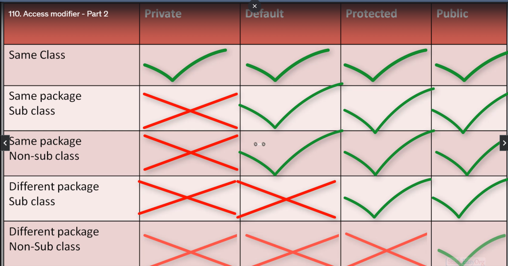

# access-modifier

types of access modifier in java
1. Default: if we don't specify any access modifier then it will be default.
2. Public
3. Private 
4. Protected

Default: No modifier is treated as default modifier. The default modifier is accessible only within package.
private: The private modifier is accessible only within class.
public: The public modifier is accessible everywhere. It has the widest scope among all other modifiers.
protected: The protected modifier is accessible within package and outside the package but through inheritance only.
but also a classes in same package one of the class can call the function of another class by passing paramter and that parameter can update
the value of a protected variable. so it is possible to update the value of a protected variable from another class in same package even if
there is no inheritance.

```java
package org.studyeasy.child;

import org.studyeasy.parent.A;

public class B extends A{

}

access modifier or access specifier , scope modifier or scope specifier all are same thing.

```java
package org.studyeasy;

import org.studyeasy.parent.A;

public class App {

	public static void main(String[] args) {
		
         new A().demo();
         int test =  new A().x;
         System.out.println(test);
	}

}

package org.studyeasy.child;

        import org.studyeasy.parent.A;

public class B extends A{

}

package org.studyeasy.parent;

public class A {
    public int x = 10;

    public void demo(){
        System.out.println("Value of x is "+x);
    }

}

```

